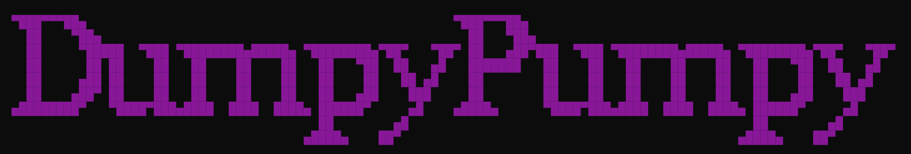

<h1 align="center"> 🍄 DumpyPumpy.v1 | Best AIO BOT </h1>

Solana Bot is the best solana trading bot featuring a token sniper, autotrade, and integration with Raydium and PUMP.FUN. It replaces BonkBot and Unibot, providing tools for managing crypto wallets and trading. Key features include solana copy trading, solana volume bot, and solana-sniping-bot. The best Solana bot for all your needs, ensuring efficient and secure trading operations.

# Video of the bot working 🦾

  <video src="https://github.com/SolDevapi/Solana-bot-dupmpypumpy/assets/170316734/b14069e7-1a62-4de9-8d5b-32b069564c56"/>

# ❗️Write "TRIAL" to the bot  for a 30-minute trial to explore its functionality❗️

### Background 🏞
DumpyPumpy enables users to use multiple customized wallet sets to perform all kinds of features in the same code, without running different scripts 😵‍💫  
Implementing custom Address Lookup Table (LUT) & complex Jito bundling technique to ensure blazingly fast transactions & efficient savings on fees 💸  
Offers the most intuitive and user-friendly UI/UX in the market, extremely user-friendly!  
The codebase is meticulously optimized to deliver unparalleled stability and speed ⚡  
Seamless integration with Raydium buy/sell after token is graduated 🎓  

#### Wombo Combo 💥🥊
🔮 Orchestrate an ultimate combo utilizing different bots & bundler all-in-one with their own customized Wallet Set settings by DumpyPumpy 😈

#### 👛 Wallet Sets setup
- Create different Wallet Sets with their own respective settings specifically for each bot like Token Bundler, Army Snipe Bot & etc.
- One Wallet Set can be shared among multiple bots as well.

#### 📦 Token Bundler
- Launch your token with our flexible bundler, which allows you to launch tokens on both Pump.fun and Raydium, buying up the majority of the floor supply (Your token will never get sniped with this method).

#### 🔫 Army Snipe Bot (optional)
- Shake out existing buyers / snipers who bought after your bundle.
- Call an insider Community Take Over (CTO).
- Snipe the token with multiple wallets, full send it to Raydium 🚀, catch another wave of snipers on Raydium before the ultimate 💩 (optional).

#### 🌊 Volume Bot
- Generate organic-like volume for your token to attract buyers.
- Can also be used after you called a Community Take Over (CTO).

#### 🔥 Bump Bot
- Consistently bumps your token to the main page of Pump.fun to gain traction and keeps it at the top of charts on GeckoTerminal and Dexscreener.

### Features 📜

#### 👛 Wallet Set
Introducing the 🦴 backbone feature of DumpyPumpy  
Enabling users to create multiple Wallet Sets, each has a Master Wallet and as many Sub Wallets as you wish  
Each Wallet Set will have its own customizable wallet settings that includes:Jito Fees, Priority Fees, Slippage & etc.  
Users are able to:
- View all wallet balances & private keys
- Bundle fund your Sub Wallets from Master Wallet (super low fees! 🤑)
- Bundle withdraw all Sub Wallets back to Master Wallet (super low fees! 🤑)
- Withdraw partial or all funds from Master Wallet to any wallet address you wish
- Transfer balance from one wallet to another
- Create or Delete Wallet Set
- Edit Wallet Set settings

#### 📦 Create Token Bundler
- Launch a token with our flexible wallet bundler, bundling from 5 to 20 wallets 👛
- Choose your desired wallet distribution method:
  - **Manual Input Distribution**
    - Manually input total bundled wallets and the SOL allocated for each wallet.
    - Total SOL, Token Amount, Distribution will be shown on every entry.
  - **Dynamic Range Distribution (Min/Max)**
    - Input total bundled wallets, minimum & maximum SOL range for each wallet.
    - Bundled wallets are undetected by Bubblemaps on Pump.fun 😈
- Sick snipers? 🔫 This bundler ensures that snipers can NEVER buy ahead of your bundled wallets 🔥
- Custom implementation of Address Look Up Table (LUT) to maximize performance in on-chain operations 🚀

#### 🌊 Volume Bot
- Utilize Sub Wallets to create organic volume for your token 🥬
- Paint an organic influx of buys with:
  - Dynamic Range Distribution of SOL buys (Min/Max)
  - Customizable organic delay between each buys

#### 🔥 Bump Bot
- Deploy a token bumper with your Sub Wallets.
- Auto rotation of Sub Wallets to consistently bump your token to the main page of Pump.fun to gain traction and visibility. Additionally, it can keep your token at the top of charts on GeckoTerminal and Dexscreener.

#### 🔫 Army Snipe Bot
- **Snipe Existing Token:**
  - Leveraging Sub Wallets to army buy an existing token.
  - Insider Community Take Over (CTO) friendly 🫂
  - Can be used to quickly buy up floor prices of an existing token before calling a Community Take Over (CTO) in community groups 🤫
- **Snipe Dev Wallet:**
  - Actively listen to new mint created by a specific wallet address.
  - Once a new mint is detected, utilize Sub Wallets to army snipe a newly minted token by the wallet address 🎯

#### 👨🏼‍💻 Manage Trades
- Fetch a list of holding tokens for token details.
  - PnL | Holding | Total Buy | Total Sold | Token Balance | Current Price | Market Cap | Pool
  - ⭐ Trade details shows the averages from all the active Sub Wallets of your Wallet Set.
  - 💰 Bundle Sell / Normal Rotation Sell at 100%, 75%, 50%, 25%
  - 😇 Additional feature of transferring all tokens from Sub Wallets to Master Wallet for a huge 💩🚽
  - 🪢 Seamless integration with Raydium buy/sell after token is graduated 🎓

#### 🛠 Settings
- Update default Wallet Set for each bot

### Setup Guide 👨🏻‍🦯
We guarantee a comprehensive after-sales support to ensure a seamless setup on your machine 🍼👶🏾  
After purchase, you will receive a detailed manual on the bot and its functionality, along with the best strategies for pumping your tokens.

### 💲Prices: 
- 10 SOL for a monthly subscription
- 25 SOL for the source code

Write "TRIAL" to the bot and we will provide you with a 30-minute trial to explore the bot and its functionality.  
For contact/purchase, use the bot: [@DumpyPumpy_bot](https://t.me/DumpyPumpy_bot)

## Contact/Purchase

